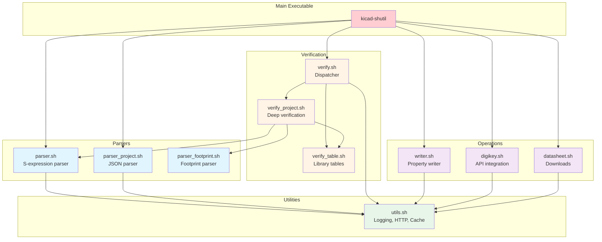
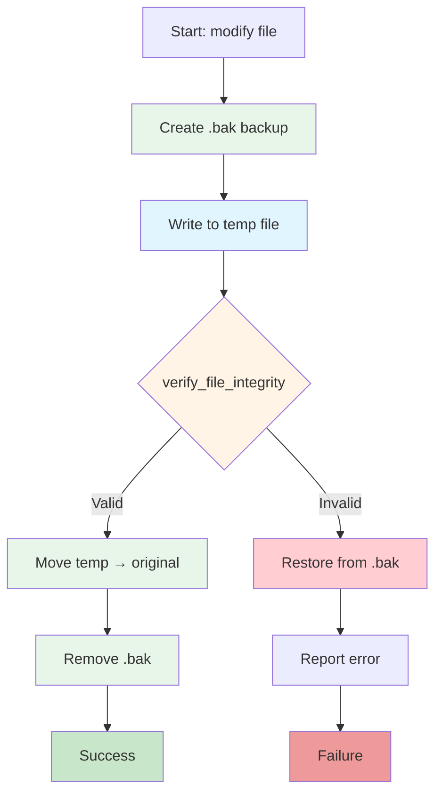
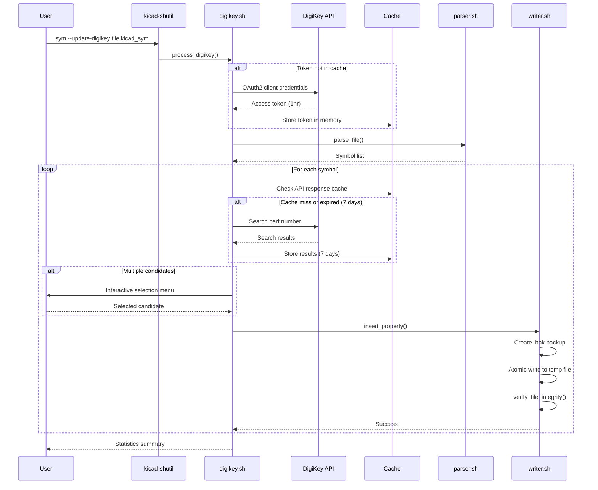
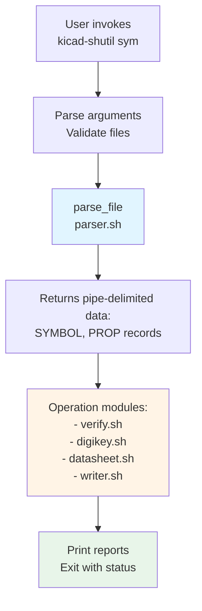
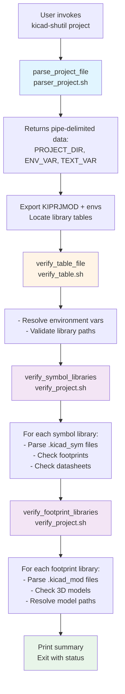
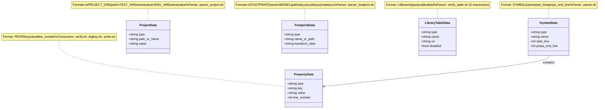
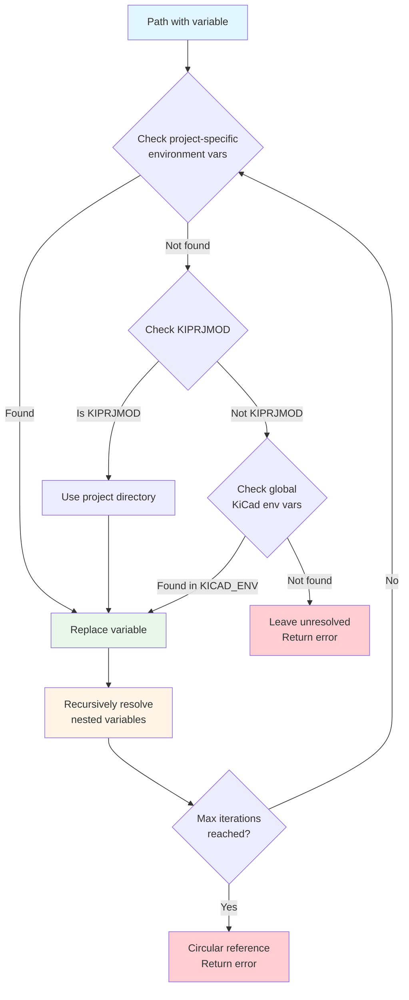
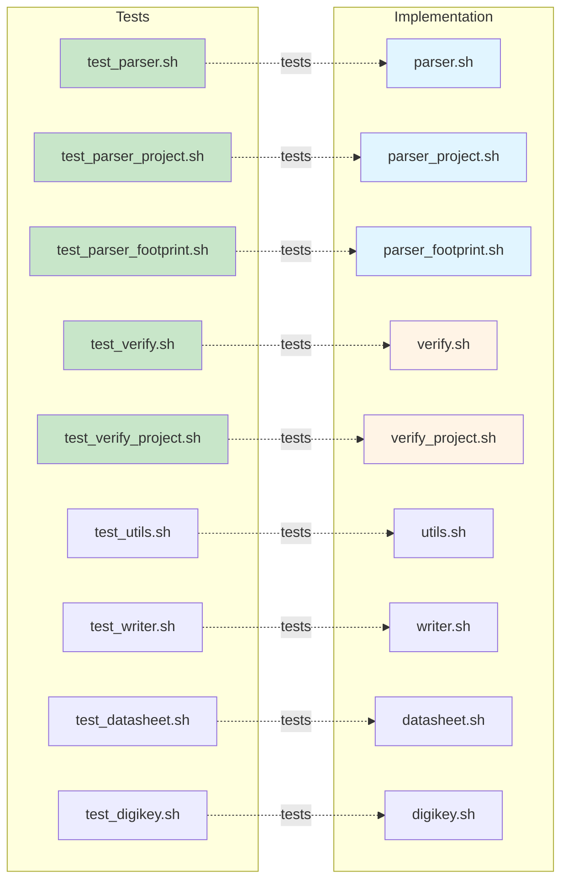

# Architecture and Design

<details>
<summary>Table of Contents</summary>

- [1. System Architecture](#1-system-architecture)
  - [Command Router (kicad-shutil)](#command-router-kicad-shutil)
- [2. Library Modules](#2-library-modules)
  - [S-Expression Parser (lib/parser.sh)](#s-expression-parser-libparsersh)
  - [Project Parser (lib/parser_project.sh)](#project-parser-libparser_projectsh)
  - [Footprint Parser (lib/parser_footprint.sh)](#footprint-parser-libparser_footprintsh)
  - [Verification Dispatcher (lib/verify.sh)](#verification-dispatcher-libverifysh)
  - [Library Table Verification (lib/verify_table.sh)](#library-table-verification-libverify_tablesh)
  - [Project Verification (lib/verify_project.sh)](#project-verification-libverify_projectsh)
  - [Property Writer (lib/writer.sh)](#property-writer-libwritersh)
  - [DigiKey API Integration (lib/digikey.sh)](#digikey-api-integration-libdigikeysh)
  - [Datasheet Download (lib/datasheet.sh)](#datasheet-download-libdatasheetsh)
  - [Utilities (lib/utils.sh)](#utilities-libutilssh)
- [3. Data Flow](#3-data-flow)
  - [Symbol Library Workflow](#symbol-library-workflow)
  - [Project Verification Workflow](#project-verification-workflow)
- [4. Design Patterns](#4-design-patterns)
- [5. Testing Strategy](#5-testing-strategy)
- [6. Configuration Management](#6-configuration-management)
- [7. Cross-Platform Considerations](#7-cross-platform-considerations)
- [8. Performance Optimizations](#8-performance-optimizations)
- [9. Future Enhancements](#9-future-enhancements)

</details>

## Quick Reference

| Module | Purpose | Key Functions | Test File |
|--------|---------|---------------|-----------|
| parser.sh | Parse symbol files | `parse_file()`, `get_property()` | test_parser.sh |
| parser_project.sh | Parse project files | `parse_project_file()`, `get_project_dir()` | test_parser_project.sh |
| parser_footprint.sh | Parse footprint files | `parse_footprint_file()`, `list_models()` | test_parser_footprint.sh |
| verify.sh | Verification dispatcher | `verify_file()`, `print_verify_report()` | test_verify.sh |
| verify_table.sh | Library table verification | `verify_table_file()`, `resolve_kicad_path()` | test_verify_table.sh |
| verify_project.sh | Deep project verification | `verify_project_file()`, `verify_symbol_libraries()` | test_verify_project.sh |
| writer.sh | Property modification | `insert_property()`, `update_property()` | test_writer.sh |
| digikey.sh | DigiKey API integration | `process_digikey()`, `search_digikey_part()` | test_digikey.sh |
| datasheet.sh | Datasheet downloads | `download_datasheets()` | test_datasheet.sh |
| utils.sh | Shared utilities | `info()`, `error()`, `http_get()` | test_utils.sh |

## 1. System Architecture

<!-- @ARCH-MAIN-001@ (FROM: @REQ-CLI-001@, @REQ-CLI-002@, @REQ-CLI-003@) -->
### Command Router (kicad-shutil)
The main executable routes commands to appropriate subcommand handlers.

**Components:**
- `main()` - Command-line argument parser and dispatcher
  - Handles `project` and `sym` subcommands
  - Implements implicit routing for `.kicad_pro` files
  - Manages global `--verbose` flag
  - Supports batch processing of multiple files
- `cmd_project()` - Project verification workflow
- `cmd_sym()` - Symbol library management workflow
  - Accepts multiple `.kicad_sym` files for batch processing
  - Aggregates statistics across all files
- `usage()` / `usage_project()` / `usage_sym()` - Help message generators

**Design Decisions:**
- Subcommand-based interface for extensibility
- Lazy loading of library modules (only source when needed)
- Global VERBOSE flag for verbose output control
- UNIX Philosophy: Silent on success, errors to stderr
- Exit codes: 0 = success, 1 = failure, 2 = usage error
- Batch processing: Sequential file processing with aggregated results

> [!TIP]
> Enable verbose mode with --verbose flag to see detailed output and INFO messages.

**Module Architecture:**



## 2. Library Modules

<!-- @ARCH-PARSER-001@ (FROM: @REQ-FILE-001@) -->
### S-Expression Parser (lib/parser.sh)
Parses KiCad S-expression format files (`.kicad_sym`).

**Functions:**
- `parse_file()` - Extract symbols and properties from `.kicad_sym` files
- `list_symbols()` - List all symbols in parsed data
- `get_property()` - Extract specific property value for a symbol
- `has_property()` - Check if symbol has a specific property

**Output Format:**
```
SYMBOL|symbol_name|start_line|props_end_line
PROP|property_name|property_value|line_number
```

**Technology:**
- AWK for pattern matching and extraction
- Handles nested graphical symbols (suffix pattern: `_N_M`)
- Compatible with GNU awk and BSD awk (macOS)

<!-- @ARCH-PARSER-002@ (FROM: @REQ-FILE-002@) -->
### Project Parser (lib/parser_project.sh)
Parses KiCad JSON format project files (`.kicad_pro`).

**Functions:**
- `parse_project_file()` - Extract project metadata
- `get_project_dir()` - Get absolute project directory path
- `get_text_var()` / `list_text_vars()` - Access text variables
- `get_env_var()` / `list_env_vars()` - Access environment variables

**Output Format:**
```
PROJECT_DIR|/absolute/path/to/project
TEXT_VAR|variable_name|variable_value
ENV_VAR|variable_name|variable_value
```

**Technology:**
- AWK for JSON parsing (no external dependencies)
- Handles nested JSON structures

<!-- @ARCH-PARSER-003@ (FROM: @REQ-FILE-001@) -->
### Footprint Parser (lib/parser_footprint.sh)
Parses KiCad footprint files (`.kicad_mod`).

**Functions:**
- `parse_footprint_file()` - Extract footprint name and 3D models
- `list_models()` - List all 3D model paths
- `count_models()` - Count 3D model references
- `get_model_info()` - Extract model transformation data

**Output Format:**
```
FOOTPRINT|footprint_name
MODEL|/path/to/model.wrl|at|x y z|scale|x y z|rotate|x y z
```

<!-- @ARCH-VERIFY-001@ (FROM: @REQ-PROJ-001@, @REQ-PROJ-002@, @REQ-PROJ-003@, @REQ-PROJ-004@) -->
### Verification Dispatcher (lib/verify.sh)
Routes verification requests to appropriate handlers based on file type.

**Functions:**
- `verify_file()` - Dispatch to file-type-specific verifier
- `init_verify_stats()` - Initialize statistics counters
- `print_verify_report()` - Generate comprehensive verification summary

**Reporting Features (REQ-PROJ-004):**
- Statistics aggregation: total symbols, OK count, issue count
- Issue categorization: missing footprints, datasheets, 3D models
- Severity levels: errors (red), warnings (yellow), info (blue)
- Detailed issue breakdown grouped by file
- Color-coded output for terminal readability
- VERBOSE mode control: full reports only when --verbose is set

**Design Pattern:**
- Strategy pattern: different verification strategies per file type
- Factory pattern: creates appropriate verifier based on file extension

<!-- @ARCH-VERIFY-002@ (FROM: @REQ-PROJ-001@) -->
### Library Table Verification (lib/verify_table.sh)
Validates KiCad library table files.

**Functions:**
- `verify_table_file()` - Verify sym-lib-table or fp-lib-table
- `resolve_kicad_path()` - Resolve environment variables in paths
- `load_kicad_environment()` - Load KiCad environment variables
- `normalize_path()` - Clean up path for display

**Disabled Library Handling:**
- Library entries with `(disabled)` field are skipped during verification
- Detection pattern: `\(disabled\)`
- These libraries are not counted in statistics or checked for existence
- In verbose mode, shows "Skipping disabled library" message

**Environment Variable Resolution:**
- Supports `${KIPRJMOD}`, `${KICAD7_SYMBOL_DIR}`, `${KICAD7_FOOTPRINT_DIR}`, etc.
- Project-specific variables from `.kicad_pro` take precedence
- Falls back to global KiCad environment variables

<!-- @ARCH-VERIFY-003@ (FROM: @REQ-PROJ-002@, @REQ-PROJ-003@) -->
### Project Verification (lib/verify_project.sh)
Comprehensive project-level verification with deep library checks.

**Functions:**
- `verify_project_file()` - Main project verification workflow
- `verify_symbol_libraries()` - Deep verification of all symbol libraries
- `verify_footprint_libraries()` - Deep verification of all footprint libraries

**Workflow:**
1. Parse project file to extract KIPRJMOD and environment variables
2. Export variables for library table resolution
3. Verify sym-lib-table and fp-lib-table
4. Deep verification: check all symbols in each library
5. Deep verification: check all footprints in each library
6. Generate comprehensive statistics and reports

**Statistics Output Format:**
```
LIBS|count
SYMBOLS|count
MISSING_FP|count
FP_NOT_FOUND|count
MISSING_DS|count
```

<!-- @ARCH-WRITER-001@ (FROM: @REQ-FILE-003@, @REQ-FILE-004@) -->
### Property Writer (lib/writer.sh)
Atomic file modification with automatic backups.

**Functions:**
- `insert_property()` - Add new property to symbol
- `update_property()` - Modify existing property value
- `delete_property()` - Remove property from symbol
- `verify_file_integrity()` - Validate S-expression syntax

**Safety Mechanisms:**
- Always create `.bak` backup before modification
- Use temporary files for atomic writes
- Verify integrity before committing changes
- Automatic rollback on failure

> [!NOTE]
> All file writes use atomic operations with automatic backups (.bak files).

**Atomic Write Pattern:**



<!-- @ARCH-DIGIKEY-001@ (FROM: @REQ-SYM-002@, @REQ-SYM-003@) -->
### DigiKey API Integration (lib/digikey.sh)
OAuth2-based DigiKey API client with caching.

**Functions:**
- `get_digikey_token()` - OAuth2 client credentials flow
- `search_digikey_part()` - Search by manufacturer + part number
- `process_digikey()` - Interactive DigiKey metadata workflow
- `delete_digikey_info()` - Remove DigiKey metadata (REQ-SYM-003)

**Metadata Addition (REQ-SYM-002):**
- Interactive selection when multiple candidates found
- Preserves existing symbol properties
- Stores DigiKey part number in "DigiKey" property
- Stores DigiKey product URL in "DigiKey URL" property
- Automatic backups before modification

**Metadata Removal (REQ-SYM-003):**
- Deletes "DigiKey" and "DigiKey URL" properties
- Preserves all other symbol properties
- Uses atomic write pattern with backup/restore
- Batch processing support for multiple files

**Caching Strategy:**
- In-memory token cache (1 hour expiry)
- File-based API response cache (7-day TTL)
- Cache invalidation based on timestamp comparison

**Configuration:**
- Load from `~/.kicad-shutil/config` or environment variables
- Required: DIGIKEY_CLIENT_ID, DIGIKEY_CLIENT_SECRET

> [!IMPORTANT]
> DigiKey API credentials are required for --update-digikey operation.

**DigiKey Integration Workflow:**



<!-- @ARCH-DATASHEET-001@ (FROM: @REQ-SYM-004@) -->
### Datasheet Download (lib/datasheet.sh)
Batch datasheet downloader with progress tracking.

**Functions:**
- `download_datasheets()` - Download all datasheets for a library
- `init_datasheet_stats()` - Initialize download statistics
- `print_datasheet_summary()` - Display download results

**Features:**
- Retry logic with exponential backoff
- Browser-like HTTP headers to avoid bot detection
- Progress tracking with statistics
- Organized by category/library name

<!-- @ARCH-UTILS-001@ (FROM: @REQ-PLAT-002@, @REQ-FILE-003@) -->
### Utilities (lib/utils.sh)
Shared utility functions for logging, HTTP, and file operations.

**Logging Functions:**
- `info()` - Informational messages (VERBOSE mode only)
- `warn()` - Warning messages (always to stderr)
- `error()` - Error messages (always to stderr)
- `success()` - Success messages (VERBOSE mode only)

**HTTP Functions:**
- `http_get()` - GET request with caching
- `http_check_url()` - Validate URL with HEAD request
- `download_file()` - Download with retry logic
- `url_encode()` - URL-encode query strings

**File Operations:**
- `backup_file()` / `restore_from_backup()` / `remove_backup()`
- `atomic_write()` - Atomic file write using temp files
- `get_file_mtime()` - Cross-platform file modification time

**Cache Management:**
- `is_cache_valid()` - Check cache expiry
- Configurable TTL per cache type

**Interactive UI:**
- `select_from_list()` - Interactive menu selection
- `start_spinner()` / `stop_spinner()` - Progress animations

## 3. Data Flow

<!-- @ARCH-FLOW-001@ (FROM: @REQ-SYM-001@) -->
### Symbol Library Workflow



<!-- @ARCH-FLOW-002@ (FROM: @REQ-PROJ-001@) -->
### Project Verification Workflow



## 4. Design Patterns

<!-- @ARCH-PATTERN-001@ (FROM: @REQ-PLAT-001@) -->
### Module Loading Strategy
Lazy loading pattern to improve startup performance.

**Implementation:**
- Main script sources only `lib/utils.sh` initially
- Other modules loaded on-demand based on subcommand
- Prevents loading DigiKey API code for simple verification tasks

<!-- @ARCH-PATTERN-002@ (FROM: @REQ-FILE-003@) -->
### Error Handling
Defensive programming with multiple safety layers.

**Techniques:**
- `set -uo pipefail` for early error detection
- Explicit return codes (0 = success, 1 = failure)
- Backup/restore mechanism for all file modifications
- File integrity verification after writes

<!-- @ARCH-PATTERN-003@ (FROM: @REQ-PLAT-002@) -->
### Pipe-Delimited Data Format
Internal data exchange using pipe-delimited text.

**Rationale:**
- No external dependencies (no JSON libraries needed)
- Easy to parse with `awk`, `cut`, `grep`
- Human-readable for debugging
- POSIX-compliant

**Example:**
```
SYMBOL|TPS54331|15|42
PROP|Value|TPS54331|17
PROP|Footprint|Package_SO:SOIC-8_3.9x4.9mm_P1.27mm|19
PROP|Datasheet|https://www.ti.com/lit/ds/symlink/tps54331.pdf|21
```

**Data Format Structure:**



<!-- @ARCH-PATTERN-004@ (FROM: @REQ-PROJ-001@) -->
### Environment Variable Resolution
Hierarchical resolution strategy for KiCad paths.

**Resolution Order:**
1. Project-specific environment variables (from `.kicad_pro`)
2. KIPRJMOD (always set to project directory)
3. Global KiCad environment variables
4. Fallback to literal path (no resolution)

> [!WARNING]
> KIPRJMOD resolution requires project context - use project verification command.

**Implementation:**
```bash
resolve_kicad_path() {
    local path="$1"
    # Replace ${VAR} with environment variable value
    # Try project vars first, then global vars
    echo "$resolved_path"
}
```

**Resolution Flow:**



## 5. Testing Strategy

<!-- @ARCH-TEST-001@ (FROM: @REQ-QA-001@) -->
### Test Organization

```
test/
├── test_parser.sh              # parser.sh unit tests
├── test_parser_project.sh      # parser_project.sh unit tests
├── test_parser_footprint.sh    # parser_footprint.sh unit tests
├── test_verify.sh              # verify.sh unit tests
├── test_verify_project.sh      # verify_project.sh unit tests
├── test_utils.sh               # utils.sh unit tests
├── test_writer.sh              # writer.sh unit tests
├── test_datasheet.sh           # datasheet.sh unit tests
├── test_digikey.sh             # digikey.sh unit tests (requires API credentials)
├── run_tests.sh                # Test runner
└── shunit2/                    # Test framework (git submodule)
```

**Test Conventions:**
- Each module has a corresponding `test_*.sh` file
- Tests disable color output for consistent assertions
- Integration tests require DigiKey API credentials (skipped in CI)
- CI runs all tests except DigiKey integration

**Test-to-Implementation Mapping:**



<!-- @ARCH-TEST-002@ (FROM: @REQ-QA-001@) -->
### Test Data Management
Fixture files in `test/fixtures/` directory.

**Structure:**
```
test/fixtures/
├── sample.kicad_sym            # Sample symbol library
├── sample.kicad_pro            # Sample project file
├── sample.kicad_mod            # Sample footprint
├── sym-lib-table               # Sample symbol table
└── fp-lib-table                # Sample footprint table
```

<!-- @ARCH-QA-001@ (FROM: @REQ-QA-002@) -->
### Static Analysis and Code Quality

**ShellCheck Integration:**
- All shell scripts checked with ShellCheck
- Configuration via `.shellcheckrc`
- Pre-commit hooks enforce compliance
- Zero critical/high-severity warnings policy

**ShellCheck Configuration:**
```bash
# .shellcheckrc
disable=SC2317  # Unreachable code (false positives in trap handlers)
shell=bash
```

**Pre-commit Hooks:**
- Automatic ShellCheck on all modified `.sh` files
- Blocks commits with ShellCheck failures
- Can be bypassed with `--no-verify` (not recommended)

**Code Formatting:**
- Uses `shfmt` for consistent formatting
- Enforced via pre-commit hooks
- Tab indentation, POSIX-style functions

**Coverage:**
- Main executable: `kicad-shutil`
- All library modules: `lib/*.sh`
- All test files: `test/*.sh`
- CI integration: GitHub Actions workflow

## 6. Configuration Management

<!-- @ARCH-CONFIG-001@ (FROM: @REQ-SYM-002@) -->
### Configuration Loading

**Loading Order (later overrides earlier):**
1. Script defaults (hardcoded in lib/digikey.sh)
2. `~/.kicad-shutil/config` (if exists)
3. Environment variables

**Configuration File Format:**
```bash
# ~/.kicad-shutil/config
DIGIKEY_CLIENT_ID="your_client_id"
DIGIKEY_CLIENT_SECRET="your_client_secret"
```

**Environment Variables:**
```bash
export DIGIKEY_CLIENT_ID="your_client_id"
export DIGIKEY_CLIENT_SECRET="your_client_secret"
```

## 7. Cross-Platform Considerations

<!-- @ARCH-COMPAT-001@ (FROM: @REQ-PLAT-001@) -->
### Platform-Specific Adaptations

**File Modification Time:**
```bash
# GNU stat (Linux, Git Bash)
stat -c %Y "$file"

# BSD stat (macOS)
stat -f %m "$file"
```

**AWK Compatibility:**
- Use POSIX-compliant AWK features
- Avoid GNU-specific extensions (gawk)
- Test with both GNU awk and BSD awk

**Path Handling:**
- Always use absolute paths internally
- Convert relative paths to absolute using `cd` + `pwd`

## 8. Performance Optimizations

<!-- @ARCH-PERF-001@ (FROM: @REQ-SYM-002@) -->
### Caching Strategy

**DigiKey API:**
- Token cache: In-memory (1 hour)
- API response cache: File-based (7 days)
- Cache key: MD5 hash of search query

**HTTP Requests:**
- Connection timeout: 10 seconds
- Max operation time: 30-60 seconds
- Retry with exponential backoff

**File Parsing:**
- Single-pass parsing with AWK
- No intermediate files
- Pipe-delimited output for efficient processing

## 9. Future Enhancements

<!-- @ARCH-FUTURE-001@ (FROM: @REQ-FUTURE-001@) -->
### Schematic Verification (Planned)

**Design Considerations:**
- Reuse S-expression parser pattern from `parser.sh`
- Create new `lib/parser_schematic.sh` module
- Integrate with existing verification framework
- Add `verify_schematic_file()` to `lib/verify.sh`

**Data Flow:**
```
.kicad_sch → parser_schematic.sh → verify.sh
                                 → Cross-reference with sym-lib-table
                                 → Validate component footprints
                                 → Check datasheet links
```
